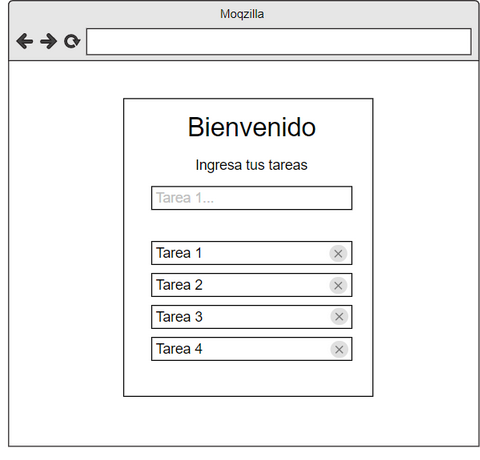

Lista de tareas - Dificultad:  🟢

Crear una aplicación web que  muestre una lista de tareas, al ingresar una tarea en el input y presionar enter, esta tarea se debe mostrar en una lista como la imagen a continuación:

deploy del ejercicio 
https://tp-react-4-5-lista-tarea.vercel.app/
